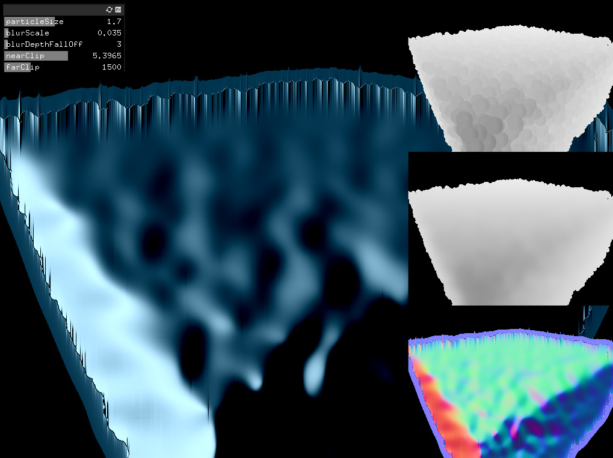
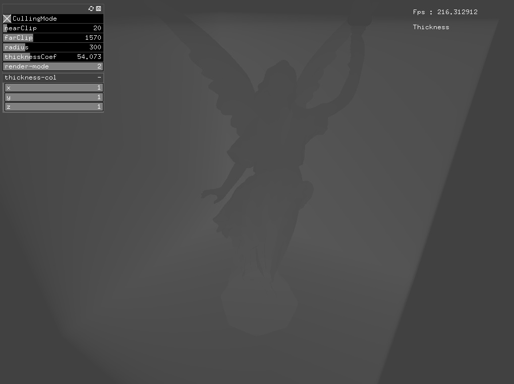
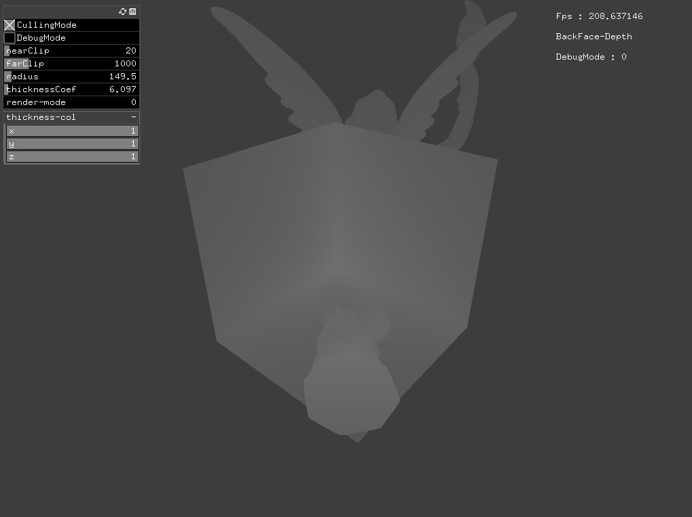
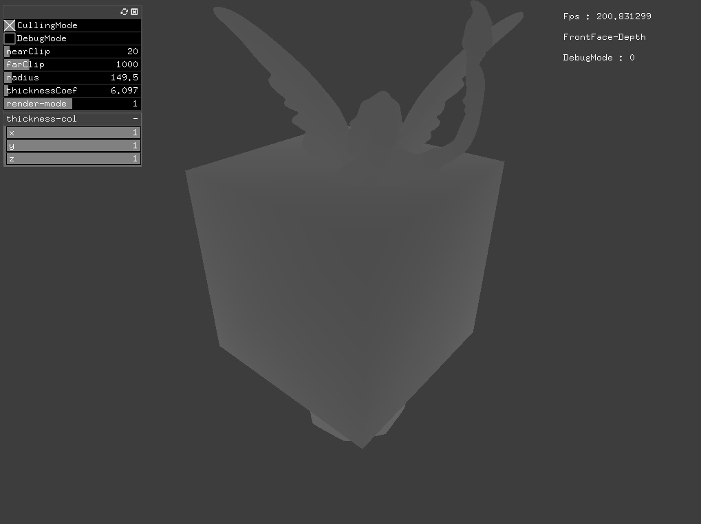
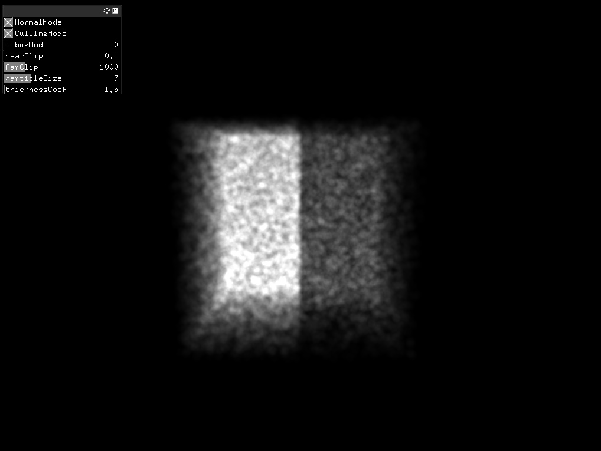

# CG-LAB2

## VBO-Mesh
SPH2D Sample

## StamFluid
StamFluid-Sample

## DepthTest
PreviewDepth

## SSFR
WIP(update coming soon)

## Thickness
- Thickness

- BackFace-Depth

- FrontFace-Depth

- ParticleThickness

